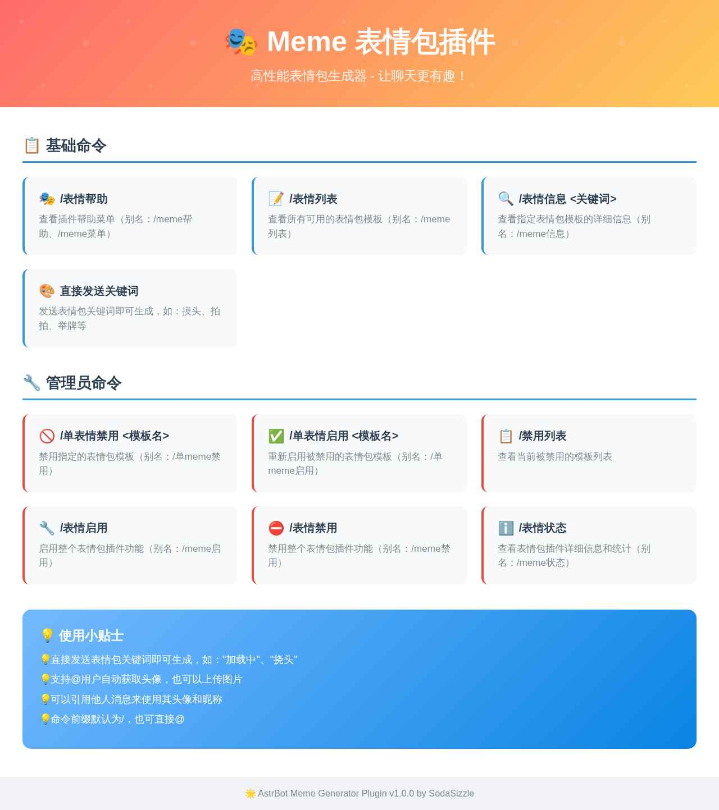
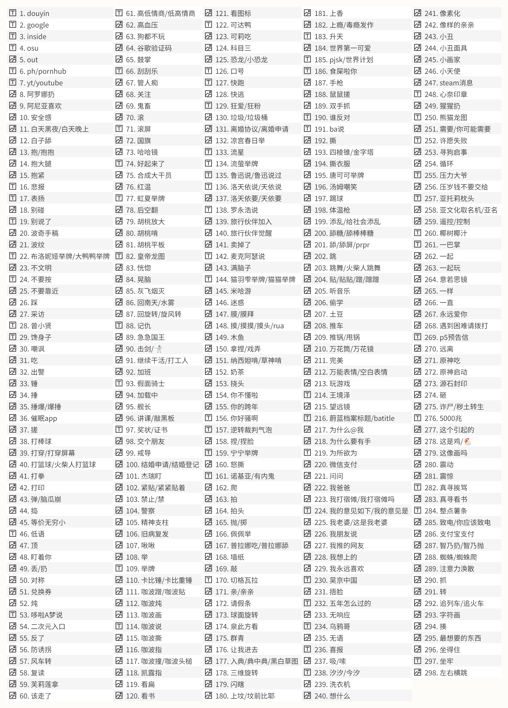
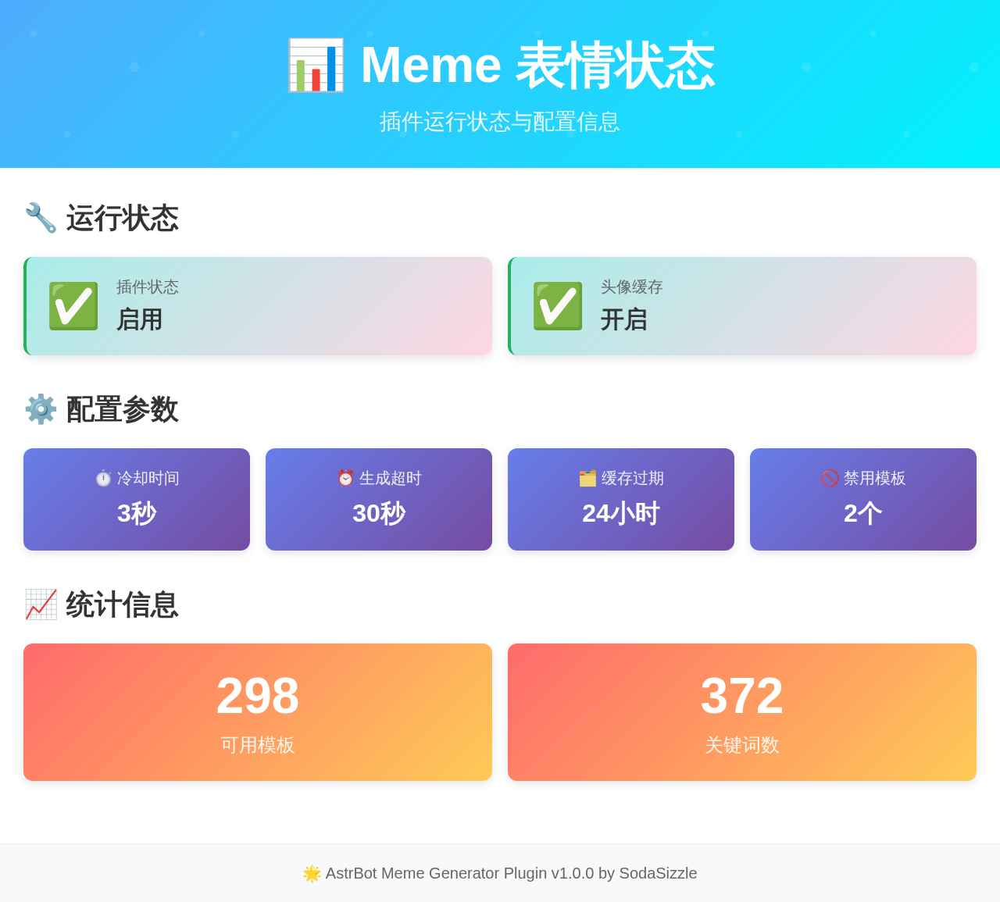

<div align="center">


# 🎭 AstrBot 表情包生成器

_✨ 高性能智能表情包生成器 - 让聊天更有趣 ✨_


</div>

## 🚀 项目简介

这是一个专为 **AstrBot** 打造的 **智能表情包生成插件**，基于 [meme-generator-rs](https://github.com/MemeCrafters/meme-generator-rs) 与 [nonebot-plugin-memes](https://github.com/MemeCrafters/nonebot-plugin-memes) 开发。插件融合了高效的图像处理与模板匹配技术，能够为用户带来多样化、灵活而有趣的表情包创作体验。

### ✨ 核心特性

- 🖼️ **多源图片支持** - 自动获取用户头像、支持上传图片、引用消息图片
- ⚡ **高性能渲染** - 基于 Rust 底层引擎，生成速度极快
- 🎨 **丰富模板库** - 内置 200+ 精选表情包模板
- 🔧 **灵活配置** - 支持黑名单管理、图片压缩、超时控制等
- 💾 **智能缓存** - 头像缓存机制，提升生成速度
- ⏱️ **冷却控制** - 防止刷屏，保护服务器资源


## 📦 快速安装

```bash
# 进入插件目录
cd /path/to/AstrBot/data/plugins

# 克隆项目
git clone http://127.0.0.1:3000/SodaSizzle/astrbot_plugin_meme_generator

# 安装依赖
pip install -r astrbot_plugin_meme_generator/requirements.txt
```

> 💡 **提示**: 启动需要几下载资源，图片模板缺失导致功能无法使用，请耐心等待。

### ⚠️ 字体问题解决

如果遇到字体相关问题，请按以下步骤解决：

**Linux 系统字体异常**：
```bash
# 设置系统语言为英文
export LANG=en_US.UTF-8
```


## ⚙️ 配置说明

### 主要配置项

| 配置项 | 类型 | 默认值 | 说明 |
|--------|------|--------|------|
| `enable_plugin` | bool | `true` | 全局控制插件是否响应用户请求 |
| `cooldown_seconds` | int | `3` | 单个用户连续生成表情包的最小间隔时间(秒) |
| `generation_timeout` | int | `30` | 单个表情包生成的最大等待时间(秒) |
| `enable_avatar_cache` | bool | `true` | 是否启用头像缓存以提升生成速度 |
| `cache_expire_hours` | int | `24` | 头像缓存的有效期(小时) |
| `disabled_templates` | list | `[]` | 禁用的表情包模板列表 |

### 缓存系统说明

- **缓存位置**: `data/cache/meme_avatars/`
- **缓存文件**: 用户头像以MD5哈希命名存储
- **元数据**: `metadata.json` 记录缓存时间戳
- **自动清理**: 每6小时自动清理过期缓存

## 📋 命令列表

### 🎮 表情帮助

<div align="center">



_✨ 表情帮助 - 查看插件完整功能菜单 ✨_

</div>

| 命令 | 功能描述 | 示例 |
|------|----------|------|
| `表情帮助` | 查看插件帮助菜单 | `表情帮助` / `meme帮助` |
| `表情列表` | 查看所有可用模板 | `表情列表` / `meme列表` |
| `表情信息 <关键词>` | 查看模板详细信息 | `表情信息 摸头` / `meme信息 拍拍` |
| `<关键词> [参数]` | 生成表情包 | `摸头 @某人` / `举牌 你好世界` |

<div align="center">



_✨ 表情列表 - 浏览所有可用的表情包模板 ✨_

</div>

### 🔧 表情状态

<div align="center">



_✨ 表情状态 - 查看插件详细运行状态和统计信息 ✨_

</div>

| 命令 | 功能描述 | 示例 |
|------|----------|------|
| `表情启用` | 启用整个插件功能 | `表情启用` / `meme启用` |
| `表情禁用` | 禁用整个插件功能 | `表情禁用` / `meme禁用` |
| `表情状态` | 查看插件详细信息和统计 | `表情状态` / `meme状态` |
| `单表情禁用 <模板名>` | 禁用指定模板 | `单表情禁用 摸头` |
| `单表情启用 <模板名>` | 启用指定模板 | `单表情启用 摸头` |
| `禁用列表` | 查看被禁用的模板列表 | `禁用列表` |


## 🎯 快速上手

### 基础使用
```
表情帮助          # 查看完整功能菜单
表情列表          # 浏览所有模板
摸头 @用户        # 生成表情包
举牌 你好世界      # 文字表情包
```

### 管理功能
```
表情状态          # 查看运行状态
单表情禁用 模板名   # 禁用指定模板
表情禁用          # 临时关闭插件
```

## 🔧 技术架构

### 核心依赖

- **[meme-generator-rs](https://github.com/MemeCrafters/meme-generator-rs)** - Rust 高性能表情包生成引擎
- **[nonebot-plugin-memes](https://github.com/MemeCrafters/nonebot-plugin-memes)** - 模板资源和算法参考
- **AstrBot** - 机器人框架和平台适配

### 架构特点

- **异步处理** - 全异步设计，支持高并发
- **模块化设计** - 核心功能模块化，易于维护和扩展
- **智能缓存** - 多层缓存机制，优化性能
- **错误恢复** - 完善的异常处理和自动恢复机制


## 📄 许可证

本项目采用 Apache 2.0 许可证 - 查看 [LICENSE](LICENSE) 文件了解详情。

## 🤝 贡献

欢迎提交 Issues 和 Pull Requests！

## ❤️ 致谢

特别感谢以下开源项目：

- [meme-generator-rs](https://github.com/MemeCrafters/meme-generator-rs) - 高性能表情包生成引擎
- [nonebot-plugin-memes](https://github.com/MemeCrafters/nonebot-plugin-memes) - 模板资源和算法参考
- [AstrBot](https://github.com/Soulter/AstrBot) - 优秀的机器人框架

---

<div align="center">

**🎉 感谢使用 AstrBot 表情包生成器！**

如果觉得好用，请给个 ⭐ Star 支持一下！

</div>
